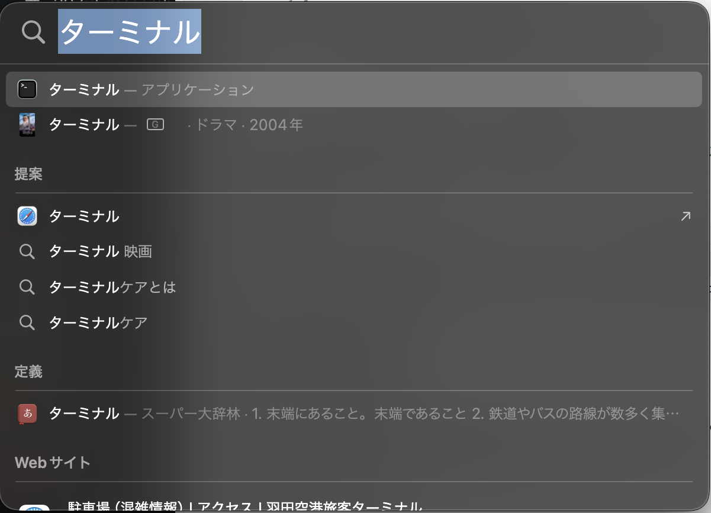
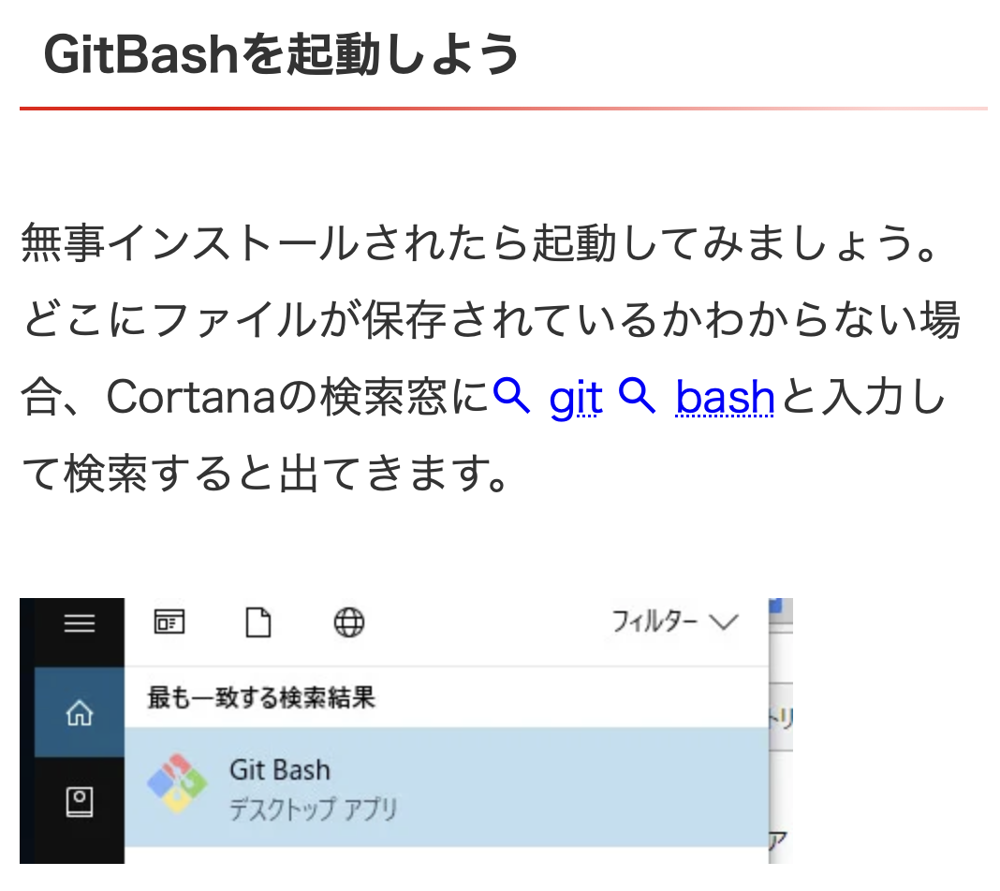

# GitとGitHubの基本　<!-- omit in toc -->
# 非プログラマ、科学計算にRを使う人向けのチュートリアル　<!-- omit in toc -->

## 目次　<!-- omit in toc -->
- [参考にしたサイト、文献](#参考にしたサイト文献)
- [イントロダクション](#イントロダクション)
  - [このチュートリアルについて](#このチュートリアルについて)
  - [バージョン管理とは](#バージョン管理とは)
  - [GitとGitHubとは](#gitとgithubとは)
- [準備](#準備)
  - [各種インストールなど](#各種インストールなど)
    - [Githubアカウントの作成](#githubアカウントの作成)
    - [RとRStudioのインストール or アップデート](#rとrstudioのインストール-or-アップデート)
    - [Gitがすでにインストールされているかチェック](#gitがすでにインストールされているかチェック)
    - [Gitが入っていなかった場合](#gitが入っていなかった場合)
    - [Gitとgithubを繋げる。](#gitとgithubを繋げる)
    - [gitクライアントについて (オプション)](#gitクライアントについて-オプション)
    - [SSHキーの設定](#sshキーの設定)


# 参考にしたサイト、文献  
- https://happygitwithr.com

# イントロダクション
## このチュートリアルについて
このチュートリアルは、プログラマではないけれど科学計算のためにRを使う人に向けた、GitとGitHubの基本的な使い方の解説です。  
GitとGitHubは、ソフトウェア開発だけでなく、データ分析や研究の分野でも非常に便利なツールです。  
このチュートリアルを通じて、GitとGitHubの基本的な概念や操作方法を学び、効率的なプロジェクト管理や共同作業ができるようになることを目指します。

## バージョン管理とは   
みなさんはwordファイルに 「report_20240630.docx」や「report_latest.docx」といったような名前をつけたことがあるでしょうか？  
もしあるなら、みなさんはすでにバージョン管理をしたことがあると言うことです。  
バージョン管理はまさに先ほどのように、テキストやスクリプトを更新するたびに新しいバージョンを作成し、変更点を追跡するプロセスです。  

先ほどのファイル名を変更してバージョン管理をする　と言うのも一つの手です。  
ただしみなさんも体感したことがあるかもしれませんが、この方法だとどれが最新版か分からなかったり、どういう変更を加えたのか分からなくなることがあります。

GitやGitHubはこれらの問題を解決してくれるツールと考えれば良いと思います。

## GitとGitHubとは
(最初に読むには難しいので飛ばして良いです)  
Gitは、ソフトウェア開発におけるバージョン管理システムの一つで、プロジェクトのソースコードの変更履歴を管理するために使用されます。
GitHubは、Gitのリポジトリをホスティングするウェブベースのサービスです。プロジェクトのコラボレーションとコード共有に特化しており、開発者がプロジェクトを公開または非公開で管理できるプラットフォームを提供します。GitHubは、プルリクエストやイシュートラッキングなどの機能を通じて、チーム内のコミュニケーションとコードレビューのプロセスを簡素化します。

GitとGitHubの組み合わせは、ソフトウェア開発プロジェクトの効率的な管理と協力を可能にします。Gitがバージョン管理と分散作業のサポートを提供する一方で、GitHubはこれらのプロセスをよりアクセスしやすく、より協力的なものにします。

GitやGitHubを使用することで、このプロセスが大幅に簡単になります。これらのツールを使うことで、以下のような利点があります：

1. **変更履歴の全記録**：過去のあらゆるバージョンから特定の変更点を簡単に確認できます。
2. **チームでの協力**：複数人で同じプロジェクトに取り組む際に、互いの作業を上書きすることなく、効率的に作業を進めることができます。
3. **ブランチ機能**：新機能の開発やバグ修正をメインのプロジェクトから分離して作業することができ、安定したバージョンを保ちながら開発を進めることが可能です。
4. **マージ機能**：異なるブランチの変更を統合することができ、スムーズにプロジェクトを一つにまとめることができます。
5. **レビュープロセス**：GitHubのプルリクエスト機能を使用することで、コードの変更を他の人がレビューし、フィードバックを提供する前にマージすることができます。

これらの機能により、個人でもチームでも、より効率的に、より安全にプロジェクトを進めることができます。GitとGitHubは、現代のソフトウェア開発において不可欠なツールとなっています。


# 準備  
## 各種インストールなど  
それでは必要なソフトなどをインストールしていきます。ここが一番大変なところです。 
### Githubアカウントの作成  
https://github.com
こちらからアカウントを作成します。日本語の記事ではこちら
https://reffect.co.jp/html/create_github_account_first_time
がわかりやすいと思います。
注意点としては、アカウント名は比較的いろんなことに使うので、恥ずかしくなくて長過ぎないものにしておきましょう。  
メールアドレスとユーザー名はすぐに使うので覚えておきましょう。

### RとRStudioのインストール or アップデート
1. Rをインストール
ここか、ミラーサイトからどうぞ  
https://cloud.r-project.org  

もしすでにRをインストールしているなら、スキップで大丈夫ですが、良い機会なのでRが最新版か確認して、必要ならアップデートしておくと良いでしょう。

2. RStudioのインストール
ここからどうぞ  
https://www.rstudio.com/products/rstudio/download/preview/

こちらももしもうインストールしているなら、スッキプ可能です。アップデートは必要ならしてください。  

### Gitがすでにインストールされているかチェック 
最初にすでにgitがインストールされていないかチェックします。  
ターミナル (windownsの場合にはコマンドプロンプト) を開きます。


以下を実行します。
Macの場合
```bash
which git
```
Windowsの場合
```bash
where git
```
(linuxの人はそもそもこの辺りでつまらないと思うので、省略)
これを入れてもし以下のような返答が返ってきているなら、すでにgitが入っています。
```
/usr/bim/git
```

ついでにバージョンをチェックしてみましょう。
```bash
git --version
## git version 2.45.2
```
こんな感じで返ってくればOK

### Gitが入っていなかった場合
インストールしてください。
こちらからどうぞ
https://git-scm.com/downloads

### Gitとgithubを繋げる。
以下をmacの場合ターミナル、windownsの場合Git Bashで実行します。
GitBashは以下のように探すといいと思います。

Your name と Your addressを自分のものに変えてください。

```
git config --global user.name "Your name"
git config --global user.email "Your address"
git config --global --list
```
これで作ったGithubアカウントとあなたのPCのGitを繋げることができます。  

### gitクライアントについて (オプション)
(最初は飛ばしてOK)
GitやGitBashは便利ですが、見た目がいかつくて難しいです。文字がたくさん出てきて真っ黒の画面を見るのが好きならそのまま使えばいいと思います。  

僕を含めて、プログラマじゃない人にはもっと画像が出てきた方が良いと思います。
そのためにあるのがGitクライアントです。GitとGitクラインアントの関係は簡単にいうならRとRStudioの関係にちかいと思います。RStudioは直感的に動かしやすいですが、裏で動いているのはRです。Rを直接動かすのは難しいと思います。そんな感じで、Gitを直感的に動かせるのがGit クライアントです。

とここまで書くと使った方が良さそうですが、正直RStudioやVisual studio codeの機能で同様のことができるので、無理に使わなくて良いと思います。
興味のある方はSourceTreeやGithub Desktopを調べてみてください。  

### SSHキーの設定
(ここはめちゃくちゃ難しいです。頑張りましょう。)  
